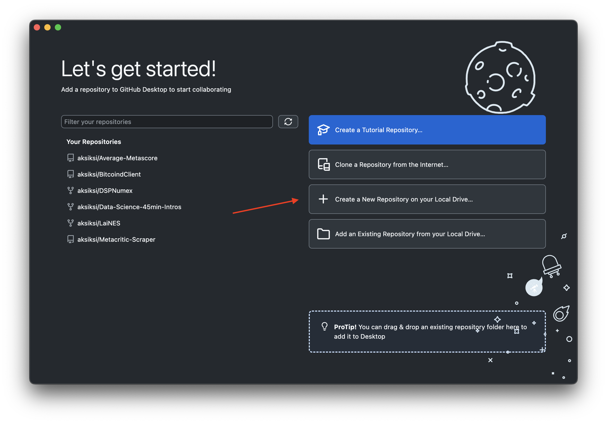
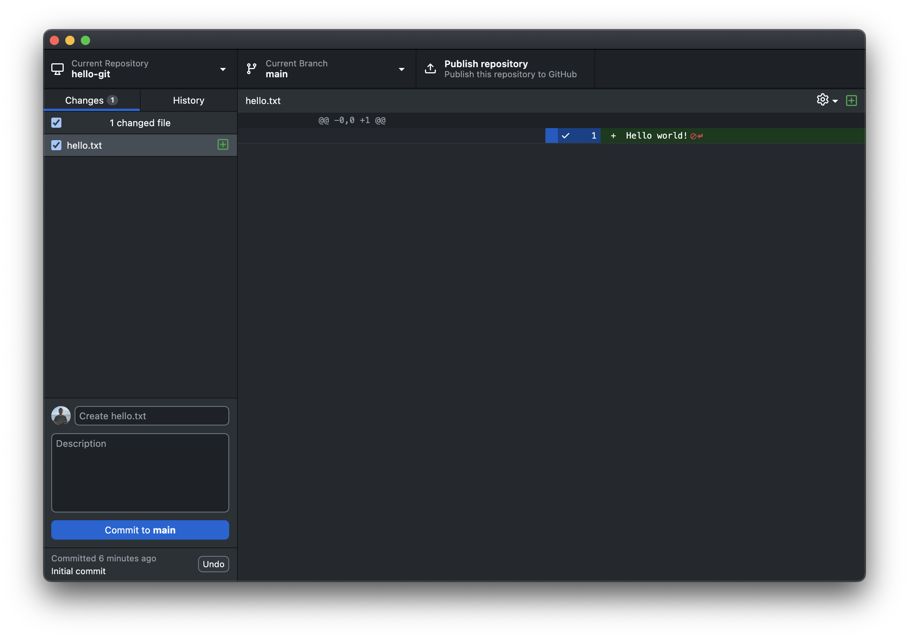
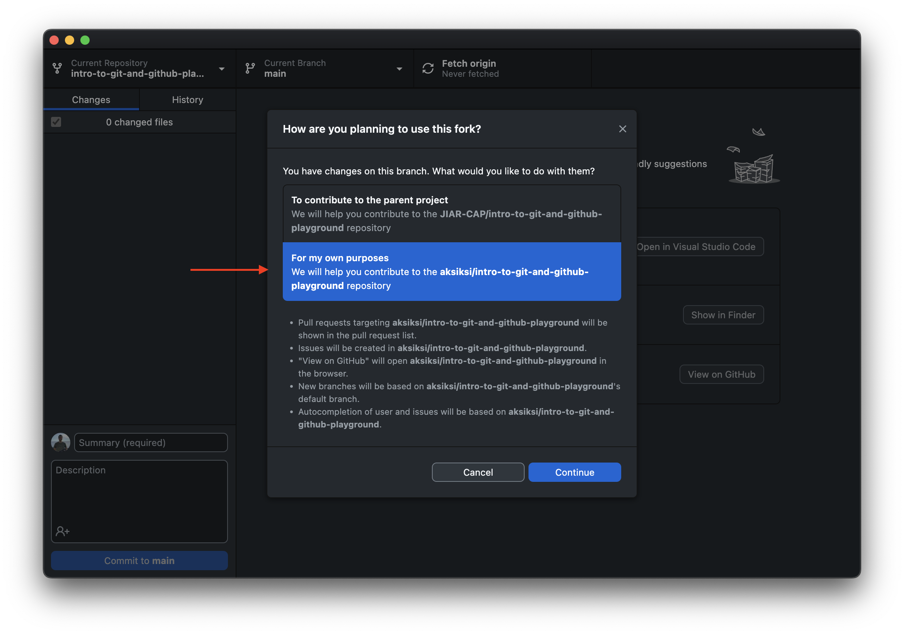

# Introduction to Git & GitHub

Playground repo: https://github.com/JIAR-CAP/intro-to-git-and-github-playground

## Outline

1. Setup
2. What is Git? Brief history, motivation
3. What is a Git repo?
4. Create a new repo
5. Basic Git operations using GitHub Desktop
6. Push your changes to GitHub
7. More commands
8. Branching
9. Fork playground repo
10. Create a pull request (PR) from a local branch
11. Fork main repo
12. Open an issue in main repo
13. Create a pull request from your fork

## First-Time Setup

### (1) Create a GitHub account

Create a GitHub account: https://github.com/join/

### (2) Install GitHub Desktop

https://desktop.github.com/download/

### (3) Install Git

#### Windows

Download & install Git: https://git-scm.com/download/win

#### macOS

1. Install Homebrew: https://brew.sh/

Open Terminal and paste the command on that page, then hit Enter.

2. Install Git:

```
brew install git
```

#### Linux

Run one of these commands based on your Linux distro: https://git-scm.com/download/linux

## What is Git?

Reference: https://git-scm.com/book/en/v2/Getting-Started-What-is-Git%3F

Cheatsheet: https://ndpsoftware.com/git-cheatsheet.html#loc=index

## What is a Git repo[sitory]?

A Git repo is basically a folder on your disk. Git can track changes inside this folder and allows you to manually build a history of changes.

The data/information required to implement this is located in a hidden directory at the root of the folder called `.git/`.

The Git application exposes a bunch of commands you can run via a terminal interface (or command-line interface, CLI). These commands read from and write to the aforementioned `.git/` folder.

## Create your Git first repo using GitHub Desktop

Open GitHub Desktop and click on "Create a New Repository on Local Drive":



Fill in the following information:

* Repository name: `hello-git`
* Description: `My first Git repo.`
* Keep everything else as-is.

### Navigating the GitHub Desktop UI

The UI shows you some important info (starting from top left):

* Name of the current repo (you can switch between them)
* Name of the current *branch* (`main`)
    * We'll get into what a branch is later.
* Publish to GitHub button
* On the left pane: current changes
* Bottom left: create a *commit*
* Middle: open this repo in your editor

Reference: https://docs.github.com/en/desktop/overview/creating-your-first-repository-using-github-desktop#part-2-creating-a-new-repository

## Basic Git operations using GitHub Desktop

### Create a new file

Let's create a file at the root called `hello.txt` with the following content:

```
Hello world!
```

Save this file and switch back to GitHub Desktop. You should see that `hello.txt` has been created:



### Commit the change

Write a short commit message and click "Commit". Click the "History" tab in the sidebar to see your commit history.

### Bonus: Inspect the Git repo on disk

In a terminal (Terminal on macOS, Git Bash on Windows):

```
ls -la ~/Documents/GitHub/hello-git/
```

### Make some changes to the file

Example:

```
Hello world!

This is another line.
```

Save the file in your editor. Now navigate over to GHD UI, and you'll see the changes. Then commit!

### Undo saved changes

Delete the word "Hello" (or make any other change). Then save & exit your editor. Oops - how do we undo this?

Head over to GHD, and you'll see the changes tracked by Git. Right-click on the changed file in the sidebar, and click "Discard Changes".

### Revert a commit

Navigate to the "History" tab in the sidebar. Right-click the top commit and select "Revert changes in commit".

This creates a *new* commit that is an undo of the selected commit.

### TODO

## Publish your repo to GitHub

At the top-right of the UI, click on the "Publish repository" button. This will push the repo to your GitHub account.

This works as a backup of your code. It also allows you to easily share your code with others.

Reference: https://docs.github.com/en/desktop/overview/creating-your-first-repository-using-github-desktop#part-4-publishing-your-repository-to-github

## Pull changes from GitHub

Make a change to the README on GitHub, then commit via UI.

Navigate to GHD and click "Fetch origin".

## Fork an existing GitHub repo

A fork is basically a copy of an existing GitHub repo, but stored under your account.

Forks allow you to experiment locally with a repo. They are also a crucial part of the open source contribution workflow - a fork allows you to propose changes to the original repo.

Fork the playground repo: https://github.com/JIAR-CAP/intro-to-git-and-github-playground

To fork it, click the "Fork" button at the top right.

## Clone a repo

Head over to the UI, click the "Current repo" button on the top-left, then "Add", then "Clone repo". Select the repo you just forked - `<your-username>/intro-to-git-and-github-playground`.

Make sure to select "For my own purposes" in the UI when prompted. This question only pops up for forks, not regular clones.



## Create a Pull Request (PR): Add your username to the repo

Create a new branch in the UI called `add-username`.

Add your username in two places:

1. New file under the `add-your-username-file` folder named `<username>.txt`
2. New entry in `add-your-username.yml`

Commit & push to GitHub. Visit GitHub UI to create a new pull request (PR).

## Create a Pull Request (PR): Implement the multiply CLI in Python

Task: implement a `multiply` CLI subcommand and add a new test for it.

Create a new branch in GHD UI called `implement-multiply`.

Commit your change(s) to the branch, then push the branch to GitHub and open a PR.

## Create a Pull Request (PR) from a fork


1. Fork the main repo: https://github.com/JIAR-CAP/intro-to-git-and-github
    * Click the "Fork" button on the top right on the website.
2. Clone the repo to GHD UI. This time, select "To contribute to the parent project" when prompted.
3. Open an issue to add a new file under `attendees`.
4. Open a PR to add your name & close the issue you created.
    * Filename should match your username, otherwise CI checks will fail :)
    * Reference the issue you created in the body of the PR - e.g., `Fixes #5`. This will ensure that the issue is closed when the PR is merged.

## Future Topics

GH Actions, GH Pages, ???

## Resources

### Videos

* Git & GH Desktop tutorial: https://www.youtube.com/watch?v=8Dd7KRpKeaE

### Text

* Git book: https://git-scm.com/book/en/v2
* Git cheatsheet: https://ndpsoftware.com/git-cheatsheet.html#loc=index;
* Git in VS Code: https://code.visualstudio.com/docs/sourcecontrol/intro-to-git
* GitHub cheatsheet: https://training.github.com/downloads/github-git-cheat-sheet.pdf 

## Appendix

### Git CLI

### Create your first repo

```
mkdir -p ~/repos/hello-git

cd ~/repos/hello-git

git init .
```

### Basic CLI commands

* `git status`
* `git diff`
* `git add`
* `git restore [--staged]`
* `git commit -m`
* `git push`
* `git commit --amend`

### `.gitignore`

Use this to ignore files you don't want to track.

### Branching and merging

Create a new local branch:

```
git checkout -b my-new-branch
```

Make changes and commit:

```
git add .
git commit -m "commit on the new branch"
```

Switch back to the main branch:

```
git checkout main
```

Merge changes on branch back to main:

```
git merge my-new-branch
```

### Stashing Changes

Stash away changes temporarily (acts as a stack):

```
git stash
```

Restore the stashed changes:

```
git stash apply
```

### Advanced CLI commands

* `git grep`: Grep, but ignores `.git/` and `.gitignore` matches
* `git diff HEAD~1`: diff HEAD against previous commit (adjust number as needed)
* **[x]** `git add -p`: add patches, allows staging only parts of your changes
* `git commit -p`: same as above, but also commit
* **[x]** `git rebase -i`: interactive rebase, reorder/merge/drop **local** commits
* **[x]** `git tag`: tagging commits (i.e., releases)
* `git show`: like `status` but shows latest commit message and content

## GitHub via Terminal

### Prerequisite: Setup SSH

This simplifies connecting to GitHub.

1. Generate a new SSH key on your machine (choose platform): https://docs.github.com/en/authentication/connecting-to-github-with-ssh/generating-a-new-ssh-key-and-adding-it-to-the-ssh-agent
2. Add the SSH key to your account: https://docs.github.com/en/authentication/connecting-to-github-with-ssh/adding-a-new-ssh-key-to-your-github-account

Clone the [playground repo](https://github.com/JIAR-CAP/intro-to-git-and-github-playground):

```
cd ~/repos/
git clone git@github.com:JIAR-CAP/intro-to-git-and-github-playground.git
cd intro-to-git-and-github-playground
```

### Push to GitHub

Commit a change, then:

```
git push
```

This will push the change up to the remote repo on GitHub. Verify by opening the repo page.

### Pull from GitHub

Make a change to the README on GitHub, then commit via UI. Go to your local repo:

```
git pull
```

Verify that you see the README commit locally.

### Create a Pull Request (PR): Add your username to the repo

Create a new branch locally:

```
git checkout -b add-my-username
```

### Create a Pull Request (PR): Implement the multiply CLI in Python

Task: implement a `multiply` CLI subcommand and add a test for it.

Create a new branch:

```
git checkout -b multiply
```

Commit your change(s) to the branch, then push the branch to GitHub.

You can now open a PR and merge it. Explain: merge vs. squash.

